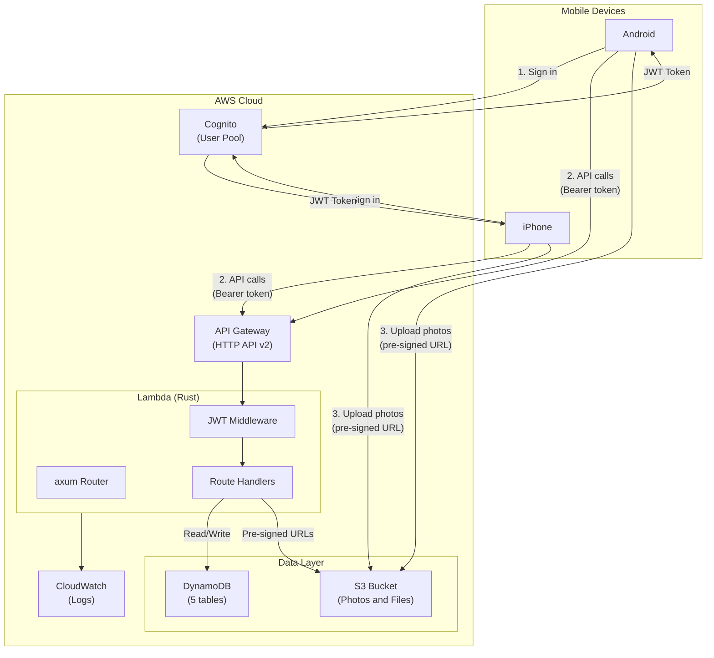
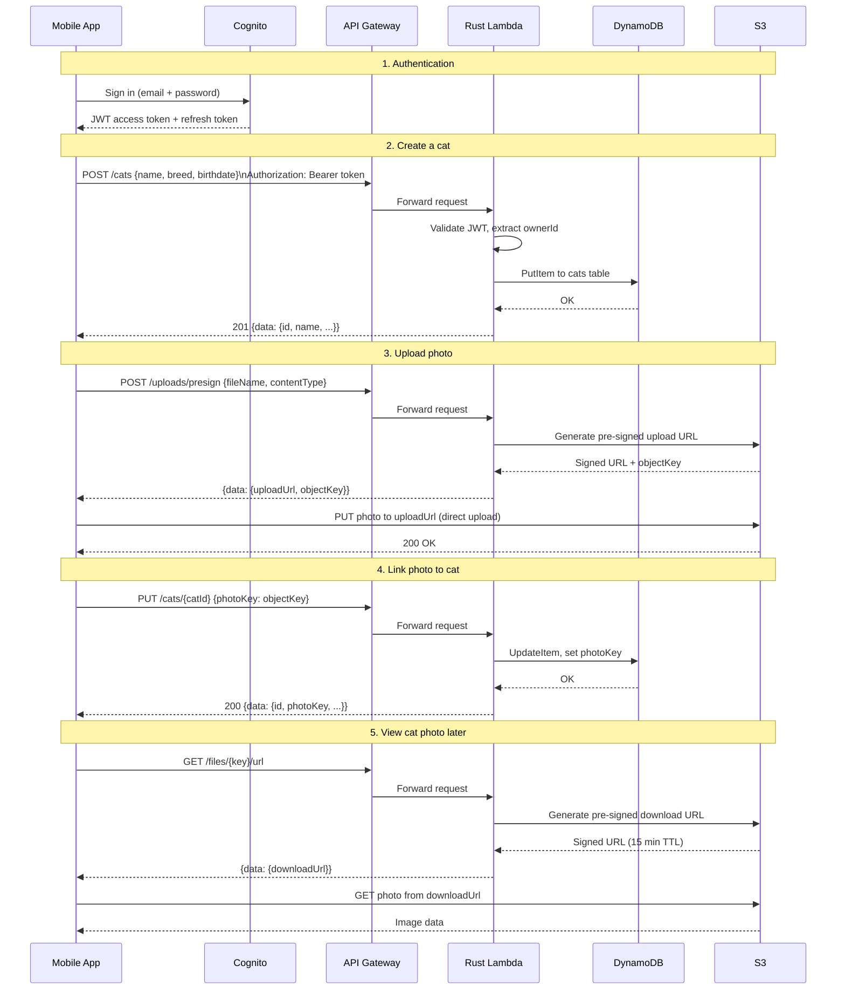
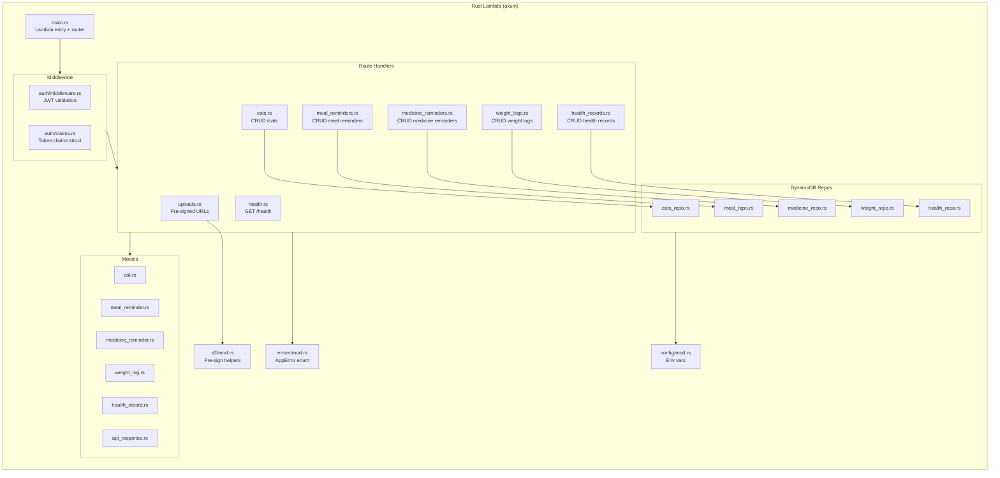
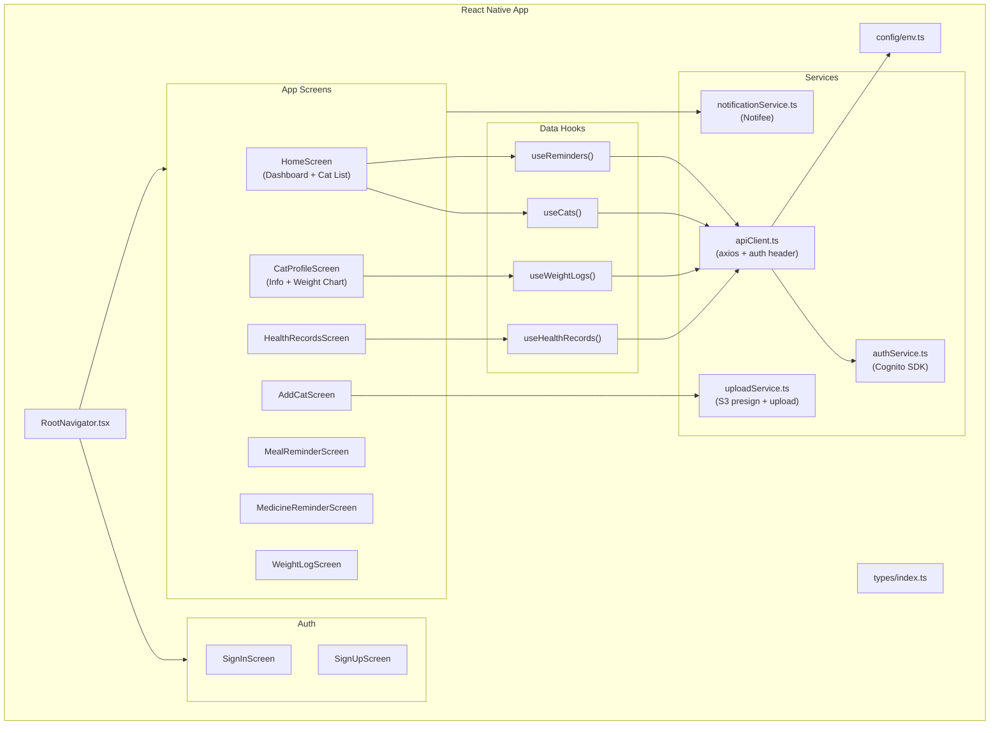
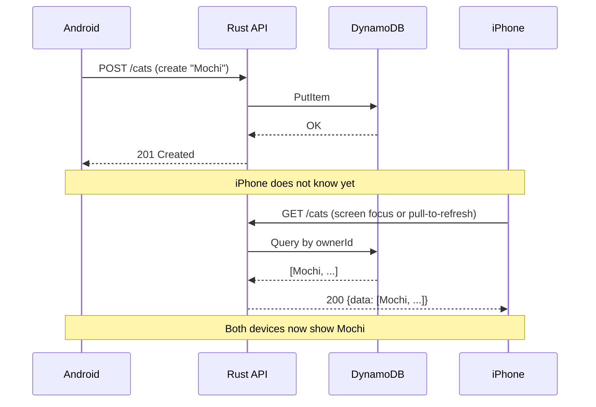

# Cat-Care App — Architecture

## 1. System Architecture Overview

How the two phones connect to AWS services.

### Flow summary

| Step | What happens |
|---|---|
| 1. Auth | Both devices sign in to Cognito and receive JWT tokens. |
| 2. API calls | All requests go through API Gateway with a Bearer token. API Gateway forwards to the Rust Lambda. Lambda validates the JWT, runs business logic, and reads/writes DynamoDB. |
| 3. File uploads | App requests a pre-signed URL from the Rust Lambda, then uploads the file directly to S3. Only the S3 object key is stored in DynamoDB. |

---

## 2. Request Flow — Create Cat with Photo Upload

Step-by-step HTTP calls when a user creates a cat and uploads a photo.

---

## 3. Rust Backend — Internal Structure

How code is organized inside the single Rust Lambda.

### Module responsibilities

| Module | Responsibility |
|---|---|
| `main.rs` | Lambda entry point, initializes tracing, builds axum router, starts lambda_http runtime. |
| `auth/` | Validates Cognito JWT from the Authorization header. Extracts `ownerId` (the `sub` claim). |
| `routes/` | HTTP handlers. Parse request, call repo, return JSON response. |
| `db/` | DynamoDB access. One file per entity. All queries filter by `ownerId`. |
| `models/` | Rust structs for domain objects, create/update request bodies, and the API response envelope. |
| `errors/` | `AppError` enum with `IntoResponse` impl. Maps errors to HTTP status codes and the standard error envelope. |
| `config/` | Reads environment variables (table names, S3 bucket, Cognito pool ID). |
| `s3/` | Generates pre-signed upload and download URLs. |

---

## 4. Mobile App — Internal Structure

How the React Native code is organized.

### Layer responsibilities

| Layer | Responsibility |
|---|---|
| **Navigator** | Routes users to auth screens (not signed in) or app screens (signed in). |
| **Screens** | UI for each feature. Calls hooks for data, renders components. |
| **Hooks** | `useCats()`, `useReminders()`, etc. Fetch data from the API, return `{ data, loading, error, refetch }`. |
| **Services** | Shared logic. `apiClient` injects auth token on every request. `authService` wraps Cognito SDK. `notificationService` schedules local reminders. `uploadService` handles S3 pre-sign + upload flow. |
| **Types** | All TypeScript interfaces in one file, matching the API contract. |
| **Config** | API base URL, Cognito IDs, S3 region. Never hardcoded in screens. |

---

## 5. Data Flow Between Devices

How Android and iPhone stay in sync without real-time subscriptions.

### Sync strategy (v1)

| Trigger | What happens |
|---|---|
| Screen mount | Fetch latest data from API. |
| Screen focus | Refetch via `useFocusEffect`. |
| After mutation | Refetch the affected list. |
| Pull-to-refresh | Manual refetch on list screens. |

This is sufficient for two devices and a small dataset. Real-time sync (WebSocket or polling) is optional for a later version.
